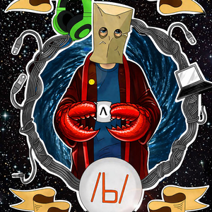

# OmegaGrid Agent

PoC AI agent platform __which we deserve__ with tool-calling loop, vector memory, conversation history, skills system, and multi-provider LLM support. 


### /b/-lobster way!


<p align="center" width="100%">
     
</p>


## Architecture

```
gateway/          FastAPI backend & API routes
core/             Agent orchestration loop
memory/           SQLite history + ChromaDB vector memory
llm/              LLM clients (Ollama + OpenAI)
tools/            Tool registry & tool adapters (vector_add, vector_search)
skills/           Skill system (weather, datetime, http_request, shell)
observability/    Timings / tracing helpers
integrations/     CLI + Telegram bot
frontend/         React UI (Query + History)
```

## Quick Start

```bash
cp .env.example .env
# Edit .env with your settings (Ollama URL, or OpenAI key)
docker compose up --build
```

- **Web UI**: http://localhost:8088
- **API**: http://localhost:8000
- **Health**: http://localhost:8000/health

---

## LLM Providers

### Ollama (default)

```env
LLM_PROVIDER=ollama
OLLAMA_URL=http://127.0.0.1:11434
OLLAMA_MODEL=llama3:latest
OLLAMA_EMBED_MODEL=nomic-embed-text
```

### OpenAI

```env
LLM_PROVIDER=openai
OPENAI_API_KEY=sk-...
OPENAI_CHAT_MODEL=gpt-4o-mini
OPENAI_EMBED_MODEL=text-embedding-3-small
```

You can also point `OPENAI_BASE_URL` at any OpenAI-compatible endpoint (Azure, local vLLM, LiteLLM, etc.).

---

## Skills

Skills are higher-level capabilities the agent can invoke. They appear as callable tools in the agent's system prompt.

### Built-in Skills

| Skill | Description | Config |
|-------|-------------|--------|
| `weather` | Current weather for any city (Open-Meteo, no API key) | - |
| `datetime` | Current UTC date/time | - |
| `http_request` | Call external HTTP APIs (GET/POST) | `SKILL_HTTP_TIMEOUT` |
| `shell` | Execute shell commands (disabled by default) | `SKILL_SHELL_ENABLED=true` |

### Creating a Custom Skill

1. Create a file in `skills/`, e.g. `skills/my_skill.py`:

```python
from skills.base import BaseSkill

class MySkill(BaseSkill):
    name = "my_skill"
    description = "Does something useful"
    parameters = {
        "input": {"type": "string", "description": "The input", "required": True},
    }

    def execute(self, input: str, **kwargs):
        return {"result": f"Processed: {input}"}
```

2. Register it in `gateway/dependencies.py`:

```python
from skills.my_skill import MySkill
# ... inside build_container():
skills.register(MySkill())
```

The agent will automatically see and use the skill.

### API Endpoints

- `GET /api/skills` - List all loaded skills
- `GET /api/tools` - List all tools
- `POST /api/query` - Query the agent (skills are auto-available)

---

## Telegram Bot Setup

### Step 1: Create a bot with BotFather

1. Open Telegram and search for `@BotFather`
2. Send `/newbot`
3. Choose a name (e.g. "OmegaGrid Agent") and username (e.g. `omegagrid_agent_bot`)
4. BotFather will give you a token like `123456789:ABCdefGHIjklMNOpqrsTUVwxyz`

### Step 2: Configure

Add to your `.env`:

```env
TELEGRAM_BOT_TOKEN=123456789:ABCdefGHIjklMNOpqrsTUVwxyz
GATEWAY_URL=http://gateway:8000
```

### Step 3: Run

**Option A - Docker (recommended)**

Uncomment the `telegram-bot` service in `docker-compose.yml`, then:

```bash
docker compose up --build
```

**Option B - Standalone**

```bash
export TELEGRAM_BOT_TOKEN=123456789:ABCdefGHIjklMNOpqrsTUVwxyz
export GATEWAY_URL=http://127.0.0.1:8000
python -m integrations.telegram.run
```

### Bot Commands

| Command | Description |
|---------|-------------|
| `/start` | Reset session, show help |
| `/ask <question>` | Explicitly ask the agent |
| `/new` | Start a fresh session |
| `/skills` | List available skills |
| *(any text)* | Automatically sent to the agent |

Each Telegram user gets their own session (tracked by chat ID). Sessions persist across messages until `/start` or `/new`.

---

## External Tool Calling

The agent can call external services through two skills:

### HTTP Requests

The `http_request` skill lets the agent call any HTTP API:

```
Agent: I'll check the API for you.
→ tool_call: http_request(url="https://api.example.com/data", method="GET")
```

### Shell Commands

The `shell` skill is **disabled by default** for safety. Enable with:

```env
SKILL_SHELL_ENABLED=true
```

Dangerous commands (`rm -rf /`, `mkfs`, `shutdown`, etc.) are blocked. The agent can then run:

```
→ tool_call: shell(command="df -h", timeout=10)
```

---

## Data Persistence

- **SQLite** (`./data/agent_memory.sqlite3`) — sessions & conversation messages
- **ChromaDB** (`./data/vector_db/`) — vector embeddings for semantic memory

---

## Environment Variables Reference

| Variable | Default | Description |
|----------|---------|-------------|
| `LLM_PROVIDER` | `ollama` | `ollama` or `openai` |
| `OLLAMA_URL` | `http://127.0.0.1:11434` | Ollama server URL |
| `OLLAMA_MODEL` | `llama3:latest` | Ollama chat model |
| `OLLAMA_EMBED_MODEL` | `nomic-embed-text` | Ollama embeddings model |
| `OLLAMA_TIMEOUT` | `120` | Ollama request timeout (seconds) |
| `OPENAI_API_KEY` | - | OpenAI API key |
| `OPENAI_BASE_URL` | `https://api.openai.com/v1` | OpenAI-compatible endpoint |
| `OPENAI_CHAT_MODEL` | `gpt-4o-mini` | OpenAI chat model |
| `OPENAI_EMBED_MODEL` | `text-embedding-3-small` | OpenAI embeddings model |
| `OPENAI_TIMEOUT` | `120` | OpenAI request timeout (seconds) |
| `AGENT_VECTOR_COLLECTION` | `memories` | ChromaDB collection name |
| `AGENT_CONTEXT_TAIL` | `30` | Messages to include as context |
| `AGENT_MEMORY_HITS` | `5` | Max vector search results |
| `AGENT_DEDUP_DISTANCE` | `0.08` | Dedup threshold for vector memory |
| `SKILL_SHELL_ENABLED` | `false` | Enable shell command skill |
| `SKILL_HTTP_TIMEOUT` | `30` | HTTP request skill timeout |
| `TELEGRAM_BOT_TOKEN` | - | Telegram bot token from BotFather |
| `GATEWAY_URL` | `http://127.0.0.1:8000` | Gateway URL for Telegram bot |
| `BACKEND_PORT` | `8000` | Gateway exposed port |
| `FRONTEND_PORT` | `8088` | Frontend exposed port |
